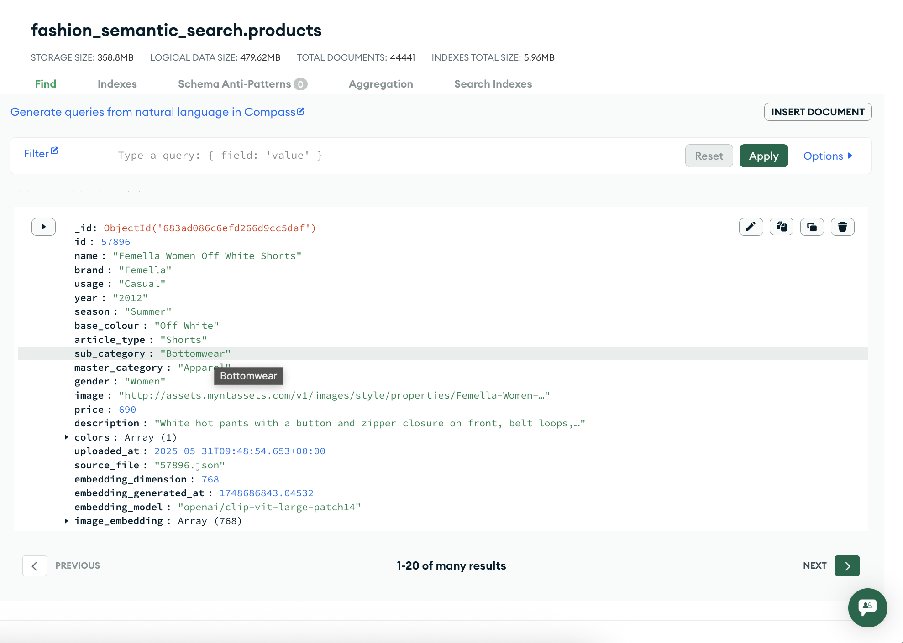

# Multimodal AI Fashion Semantic Search


A cutting-edge semantic search engine powered by **MongoDB Atlas Vector Search** and **HuggingFace CLIP** that revolutionizes fashion discovery through AI-powered multimodal search capabilities. Search for fashion items using natural language descriptions or upload images to find visually similar products using advanced vector embeddings and similarity matching.

[Hashnode Blog Link](https://shaunliew.hashnode.dev/building-semantic-image-search-with-clip-and-mongodb-vector-search-from-concept-to-code?showSharer=true)

## 🌟 What Makes This Special

This project showcases the power of **MongoDB Atlas Vector Search** combined with **HuggingFace CLIP** to demonstrate:
- **HuggingFace CLIP (ViT-Large)**: State-of-the-art multimodal AI using `openai/clip-vit-large-patch14` model
- **MongoDB Atlas Vector Search**: Production-ready vector database with sub-second similarity search
- **768-Dimensional Embeddings**: High-fidelity vector representations from CLIP's Vision Transformer
- **Cosine Similarity Matching**: Mathematical precision in finding visually and semantically similar items
- **Real-time Vector Indexing**: Instant search across millions of fashion items


## ✨ Features

### 🔍 Dual Search Modes

**Text-to-Image Semantic Search**

- Natural language queries like "red evening dress" or "casual summer outfit"
- Understands context, style, and fashion terminology
- Returns visually relevant results even without exact keyword matches

**Image-to-Image Search**

- Upload any fashion image to find similar styles
- **Powered by HuggingFace CLIP** (`openai/clip-vit-large-patch14`) for cross-modal understanding
- **MongoDB Atlas Vector Search** efficiently finds products with similar colors, patterns, and silhouettes
- **768-dimensional embeddings** from Vision Transformer capture fine-grained visual details

### 📊 Search Analytics & Details

- Detailed similarity scores and matching confidence
- Visual embedding analysis for educational purposes
- Real-time search performance metrics


## 🏗️ Technical Architecture

**Frontend Stack:**
- **Next.js 14** with App Router for modern React development
- **TypeScript** for type safety and better developer experience
- **TailwindCSS** for utility-first responsive design
- **Zustand** for lightweight state management
- **shadcn/ui** for beautiful, accessible UI components

**Backend Stack:**
- **FastAPI** for high-performance async API development
- **PyMongo** for connecting to MongoDB Atlas to perform vector search
- **HuggingFace Transformers** with CLIP (`openai/clip-vit-large-patch14`) for multimodal embeddings
- **PyTorch** for deep learning model execution with GPU/MPS support
- **uv** for fast Python package management

**Database & Vector Search:**
- **MongoDB Atlas Vector Search** - Production-grade vector database with native similarity search
- **HuggingFace CLIP Integration** - `openai/clip-vit-large-patch14` model (768 dimensions)
- **Cosine similarity indexing** for precise semantic and visual matching
- **Sub-second search performance** across large-scale fashion datasets

## 🎯 MongoDB Atlas Vector Search + HuggingFace CLIP Integration

### Database Configuration


### Collection Structure

Our fashion items are stored with rich metadata including embeddings, categories, and attributes.

### Vector Search Indexes

Configured for optimal performance with 768-dimensional CLIP embeddings.

### Vector Search Implementation

**MongoDB Atlas Vector Search** with advanced aggregation pipelines for semantic similarity matching using **HuggingFace CLIP-generated embeddings**.

### Vector Embeddings in Action

Real vector embeddings stored as 768-dimensional arrays, enabling mathematical similarity comparisons.

## 🚀 Getting Started

### Prerequisites

- **Node.js** 18+ for frontend development
- **Python** 3.9+ for backend services
- **uv** Python package manager ([Install Guide](https://docs.astral.sh/uv/getting-started/installation/))
- **MongoDB Atlas** account with Vector Search enabled

### Installation

1. **Clone the repository**
   ```bash
   git clone https://github.com/yourusername/multimodal-ai-fashion-semantic-search.git
   cd multimodal-ai-fashion-semantic-search
   ```

2. **Setup Frontend**
   ```bash
   cd frontend
   npm install
   ```

3. **Setup Backend**
   ```bash
   cd backend
   uv pip install -r requirements.txt
   ```

4. **Environment Configuration**
   ```bash
   # Backend (.env)
   MONGODB_URI=your_mongodb_atlas_connection_string
   DATABASE_NAME=fashion_search
   COLLECTION_NAME=fashion_items
   
   # Frontend (.env.local)
   NEXT_PUBLIC_API_URL=http://localhost:8000
   ```

### Database Setup

1. **Create MongoDB Atlas Cluster** (Free tier available)
2. **Enable Vector Search** in your cluster settings
3. **Create Vector Search Index** optimized for **HuggingFace CLIP embeddings**:
   ```json
   {
     "fields": [
       {
         "type": "vector",
         "path": "image_embedding",
         "numDimensions": 768,
         "similarity": "cosine"
       }
     ]
   }
   ```

## 🏃‍♂️ Running the Application

1. **Start Backend Server**
   ```bash
   cd backend
   uvicorn main:app --reload --port 8000
   ```

2. **Start Frontend Development Server**
   ```bash
   cd frontend
   npm run dev
   ```

3. **Access Application**
   - Frontend: `http://localhost:3000`
   - Backend API: `http://localhost:8000`
   - API Documentation: `http://localhost:8000/docs`

## 🧠 Learning Concepts

### HuggingFace CLIP & Vector Embeddings
Learn how **HuggingFace CLIP** converts images and text into mathematical vectors that capture semantic meaning:
- [Understanding CLIP](https://openai.com/research/clip) - Original OpenAI research paper
- [HuggingFace CLIP Model](https://huggingface.co/openai/clip-vit-large-patch14) - Model documentation and usage
- [HuggingFace Transformers](https://huggingface.co/docs/transformers/model_doc/clip) - CLIP implementation guide
- [Vision Transformer (ViT) Architecture](https://arxiv.org/abs/2010.11929) - Understanding the vision component

### MongoDB Atlas Vector Search
Discover how **MongoDB Atlas** enables production-ready semantic search:
- [MongoDB Atlas Vector Search Guide](https://www.mongodb.com/docs/atlas/atlas-vector-search/) - Official documentation
- [Vector Search Tutorial](https://www.mongodb.com/developer/products/atlas/semantic-search-mongodb-atlas-vector-search/) - Hands-on tutorial
- [Cosine Similarity in ML](https://en.wikipedia.org/wiki/Cosine_similarity) - Mathematical foundation

### Multimodal AI
Explore how AI systems understand both visual and textual content:
- [Multimodal Deep Learning](https://arxiv.org/abs/2103.00020)
- [Cross-Modal Retrieval](https://paperswithcode.com/task/cross-modal-retrieval)

## 🛠️ Development

### Project Structure
```
├── frontend/
│   ├── src/
│   │   ├── app/           # Next.js 14 app router
│   │   ├── components/    # Reusable UI components
│   │   ├── hooks/         # Custom React hooks
│   │   ├── lib/          # Utilities and configurations
│   │   ├── stores/       # Zustand state management
│   │   └── types/        # TypeScript type definitions
│   ├── public/           # Static assets
│   ├── package.json      # Frontend dependencies
│   └── next.config.ts    # Next.js configuration
├── backend/
│   ├── main.py           # FastAPI application entry point
│   ├── generate_embeddings.py    # CLIP embedding generation
│   ├── upload_dataset.py         # Dataset upload utilities
│   ├── test_vector_search.py     # Vector search testing
│   ├── dataset/          # Fashion dataset files
│   │   ├── images/       # Fashion item images
│   │   ├── styles.csv    # Product metadata
│   │   └── images.csv    # Image metadata
│   ├── logs/            # Application logs
│   ├── pyproject.toml   # Python dependencies (uv)
│   └── ruff.toml        # Code linting configuration
└── assets/              # Demo images and documentation
```

### Code Quality
- **TypeScript** for type safety and better developer experience
- **Educational comments** explaining AI/ML concepts
- **Progressive complexity** from basic to advanced features
- **Learning-focused documentation** with external resources

## 📈 Performance

**MongoDB Atlas Vector Search** delivers exceptional performance:
- **Sub-second search** across millions of fashion items
- **Batch processing** for multiple image uploads with HuggingFace CLIP
- **768-dimensional Vision Transformer embeddings** for high-fidelity semantic matching
- **Optimized cosine similarity** computation at database level
- **Native vector indexing** eliminates need for external vector databases
- **Multi-device support** (CPU/GPU/Apple MPS) for optimal performance
**Learning Goal**: Every component of this project demonstrates how **MongoDB Atlas Vector Search** and **HuggingFace CLIP** work together to create production-ready semantic search applications. Perfect for understanding modern AI/ML concepts, vector databases, and multimodal search implementations.
